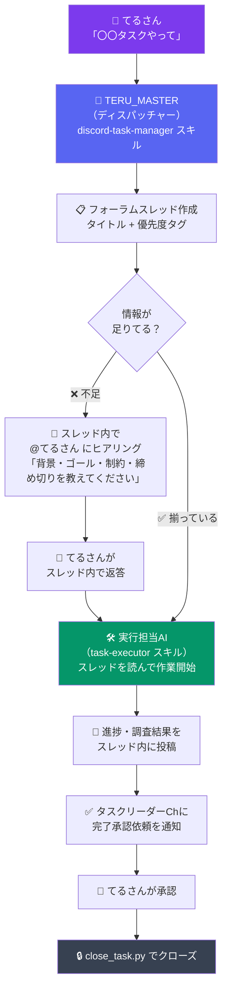

# 🤖 openclaw-discord-task-manager

[](https://github.com/naoterumaker/openclaw-discord-task-manager)
[](LICENSE)
[](https://github.com/naoterumaker)
[](https://discord.com)

> **Discordフォーラムチャンネルをタスクボードに変える、OpenClaw用AIタスク管理スキルセット。**

---

## 📖 概要

このリポジトリは、**OpenClaw × Discord** を組み合わせたAIタスク管理システムです。

「タスクを追加して」とAIに言うだけで、Discordのフォーラムチャンネルにスレッドが自動作成されます。ヒアリング・作業・完了報告まで、**すべてがフォーラムスレッド内で完結**するシンプルな設計です。

### 🎯 誰向け？

- OpenClawを使ってAIに仕事を任せたい人
- Discordをハブにしてタスク管理を自動化したい人
- 「AIと一緒に仕事する」ワークフローを探している人

### 💡 なぜ OpenClaw + Discord なのか？

| 要素 | 役割 |
|------|------|
| **OpenClaw** | AIエージェントの実行基盤。スキルを登録すると自然言語で呼び出せる |
| **Discordフォーラム** | スレッド = タスクカード。ヒアリング・作業ログ・完了報告が一箇所に集約 |
| **スキル分離** | ディスパッチャー（振り役）と実行担当を分けることで、どのAIでも引き継げる |

---

## 🗺 コンセプト図



---

## ✨ 機能一覧

### 1. ディスパッチャー（`discord-task-manager`）

TERU_MASTERが担う「振り役」スキル。タスクを受け取り、Discordフォーラムスレッドを作成する。

| 機能 | スクリプト |
|------|-----------|
| タスク追加・スレッド作成 | `add_task.py` |
| タスク一覧表示 | `list_tasks.py` |
| タスクのクローズ | `close_task.py` |
| 朝サマリー（cron 8:10） | `morning_summary.py` |
| 夜サマリー（cron 22:00） | `evening_summary.py` |
| タグ操作 | `tag_task.py` |
| スレッドへの投稿 | `post_to_thread.py` |

### 2. 実行担当（`task-executor`）

スレッドを読んだAIが「実行担当」として動くスキル。**subagentに依存しない** — スレッドの指示書さえ読めば誰でも引き継げる設計。

### 3. cron 自動サマリー

| 時刻 | 内容 |
|------|------|
| 毎朝 8:10 | 未完了タスクの一覧を朝サマリーとして投稿 |
| 毎夜 22:00 | 当日の作業完了状況を夜サマリーとして投稿 |

### 4. タグ管理

| タグ | 意味 |
|------|------|
| 🔴高 | 優先度：高 |
| 🟡中 | 優先度：中（デフォルト） |
| 🟢低 | 優先度：低 |
| 📚ナレッジ | 調査系タスク（完了後もスレッドを残す） |
| 完了 | てるさんの承認後にクローズ |
| ⏸ブロック中 | 依存タスク待ち |
| ⏩実行可 | 自律実行が承認済み |

---

## 🚀 セットアップ手順

### 必要なもの

- [OpenClaw](https://github.com/naoterumaker) がインストールされていること
- Discordボットトークン（フォーラムチャンネルへの書き込み権限付き）
- Python 3.10+
- `discord.py` または `requests` ライブラリ

### 手順

**1. リポジトリをスキルディレクトリに配置する**

```bash
git clone https://github.com/naoterumaker/openclaw-discord-task-manager \
  ~/clawd/skills/discord-task-manager-repo
```

**2. スキルをコピーする**

```bash
cp -r ~/clawd/skills/discord-task-manager-repo/discord-task-manager \
  ~/clawd/skills/discord-task-manager
cp -r ~/clawd/skills/discord-task-manager-repo/task-executor \
  ~/clawd/skills/task-executor
```

**3. 環境変数を設定する**

```bash
export DISCORD_TOKEN=your_bot_token
```

または `discord-task-manager/scripts/config.py` に直接記述：

```python
DISCORD_TOKEN = "your_bot_token"
GUILD_ID = "your_guild_id"
FORUM_CHANNEL_ID = "your_forum_channel_id"
TASK_LEADER_CHANNEL_ID = "your_task_leader_channel_id"
```

**4. config.py のIDを自分の環境に書き換える**

```python
# discord-task-manager/scripts/config.py

GUILD_ID            = "1474320833269993475"   # あなたのサーバーIDに変更
FORUM_CHANNEL_ID    = "1475147089871769643"   # フォーラムチャンネルIDに変更
TASK_LEADER_CHANNEL_ID = "1475156472072503377" # タスクリーダーChIDに変更
USER_ID             = "971703824198824008"    # あなたのDiscord IDに変更
```

**5. OpenClaw に `available_skills` として登録する**

`~/clawd/AGENTS.md` または OpenClaw 設定ファイルにスキルパスを追加してください。

---

## 💬 使い方

### タスクを追加する

```bash
# 基本（ヒアリングあり）
python ~/clawd/skills/discord-task-manager/scripts/add_task.py \
  --title "ランディングページのコピーを改善する" \
  --priority 高

# 情報が揃っている場合（即実行）
python ~/clawd/skills/discord-task-manager/scripts/add_task.py \
  --title "ランディングページのコピーを改善する" \
  --priority 高 \
  --body "背景: CVRが低い。ゴール: CTAを3箇所追加。締め切り: 今週中。"

# 調査タスクとして追加
python ~/clawd/skills/discord-task-manager/scripts/add_task.py \
  --title "競合他社のSEO戦略を調査" \
  --priority 中 \
  --knowledge
```

### タスク一覧を確認する

```bash
# テキスト表示
python ~/clawd/skills/discord-task-manager/scripts/list_tasks.py

# JSON形式（他スクリプトとの連携用）
python ~/clawd/skills/discord-task-manager/scripts/list_tasks.py --json
```

### タスクをクローズする

```bash
python ~/clawd/skills/discord-task-manager/scripts/close_task.py <スレッドID>
```

### 朝・夜サマリーを手動実行

```bash
# 朝サマリー
python ~/clawd/skills/discord-task-manager/scripts/morning_summary.py

# 夜サマリー
python ~/clawd/skills/discord-task-manager/scripts/evening_summary.py
```

### 自然言語での呼び出し（OpenClaw経由）

OpenClaw のチャットで以下のように話しかけるだけで自動実行されます：

| 言葉かけ | 実行されるアクション |
|---------|-----------------|
| 「タスク追加：〇〇」 | `add_task.py` |
| 「タスク一覧」「何が残ってる？」 | `list_tasks.py` |
| 「〇〇完了」「〇〇終わった」 | ID特定 → `close_task.py` |
| 「調査タスク：〇〇」 | `add_task.py --knowledge` |

---

## 📁 スキル構成

```
openclaw-discord-task-manager/
│
├── README.md                      ← このファイル
├── TASK_SYSTEM_DESIGN.md          ← 設計思想・決断の記録
│
├── discord-task-manager/          ← ディスパッチャースキル（TERU_MASTERが読む）
│   ├── SKILL.md                   ← スキル定義・全体フロー・コマンド一覧
│   └── scripts/
│       ├── config.py              ← ID・トークン設定ファイル
│       ├── add_task.py            ← タスク追加（スレッド作成 + ヒアリング投稿）
│       ├── list_tasks.py          ← 未完了タスク一覧
│       ├── close_task.py          ← タスク完了・タグ付け
│       ├── tag_task.py            ← タグの追加・削除
│       ├── post_to_thread.py      ← スレッドへのメッセージ投稿
│       ├── morning_summary.py     ← 朝サマリー（cron 8:10 推奨）
│       ├── evening_summary.py     ← 夜サマリー（cron 22:00 推奨）
│       └── watch_and_execute.py   ← スレッド監視・自動実行トリガー
│
└── task-executor/                 ← 実行担当スキル（スレッドを読んだAIが使う）
    └── SKILL.md                   ← 実行フロー・禁止事項・ヒアリング形式
```

### 各ファイルの役割

| ファイル | 説明 |
|---------|------|
| `discord-task-manager/SKILL.md` | ディスパッチャーの設計書。TERU_MASTERがこれを読んでタスクを受け付ける |
| `task-executor/SKILL.md` | 実行担当の設計書。スレッドを読んだどのAIでもこれに従って動く |
| `scripts/config.py` | サーバーID・チャンネルID・ユーザーIDを一元管理 |
| `scripts/add_task.py` | フォーラムにスレッドを作成し、必要に応じてヒアリングメッセージを投稿 |
| `scripts/list_tasks.py` | 未完了タスクをDiscord APIから取得して表示 |
| `scripts/close_task.py` | 「完了」タグを付けてスレッドをアーカイブ |
| `scripts/tag_task.py` | スレッドのタグを追加・削除 |
| `TASK_SYSTEM_DESIGN.md` | 設計の意図・トレードオフ・今後の拡張方針 |

---

## 🧠 設計思想

このシステムの根幹にある考え方：

> **「スレッド = 指示書」**  
> スレッドを読めば、どのAIでも（どのセッションでも）作業を引き継げる。

詳細は → [TASK_SYSTEM_DESIGN.md](./TASK_SYSTEM_DESIGN.md)

---

## 作者

[naoterumaker](https://github.com/naoterumaker)
